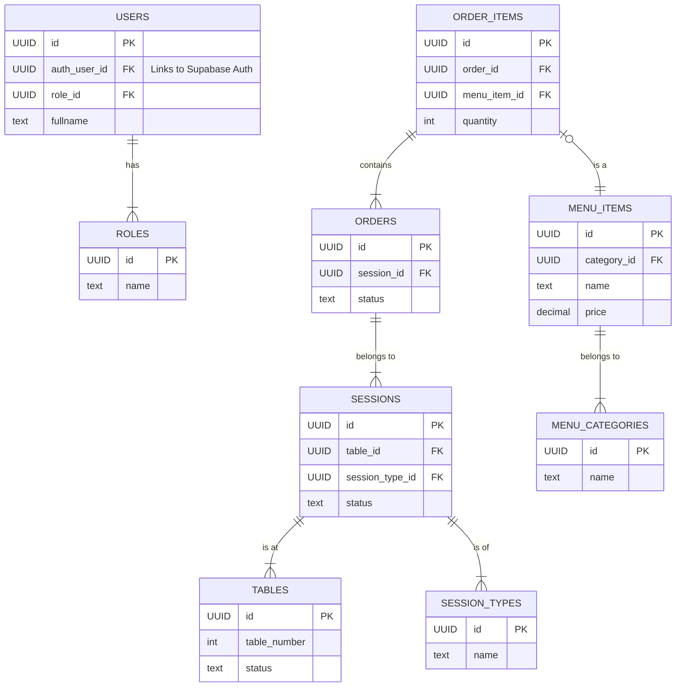
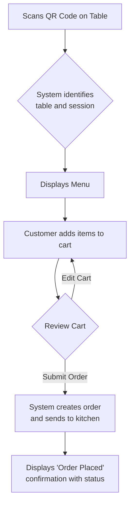

# Technical Project Book: QR-Menu Pro

## 1. Executive Summary

### Abstract
**QR-Menu Pro** is a comprehensive, real-time restaurant management system designed to replace traditional, inefficient paper-based workflows. By leveraging modern web technologies, the system streamlines the entire dining experience, from digital menu browsing and ordering via QR codes to session management, automated billing, and operational analytics. The platform aims to significantly improve staff efficiency, reduce order errors, increase table turnover, and provide a superior, modern experience for the customer.

### Target Audience

*   **Persona 1: The Diner (Customer)**
    *   **Role:** Restaurant Patron
    *   **Goals:** Wants a quick, convenient, and contactless way to view the menu, place an order, and pay the bill. Appreciates seeing real-time order status.
    *   **Frustrations:** Dislikes waiting for a physical menu, trying to get a waiter's attention, and dealing with incorrect orders or billing errors.

*   **Persona 2: The Waiter**
    *   **Role:** Floor Staff
    *   **Goals:** Wants to manage multiple tables efficiently, take orders accurately, and provide prompt service. Needs to be instantly notified of customer requests and order readiness.
    *   **Frustrations:** Juggling too many tables, handwriting orders which can lead to errors, and running back and forth between the kitchen, front desk, and customers.

*   **Persona 3: The Kitchen Staff**
    *   **Role:** Chef / Cook
    *   **Goals:** Wants a clear, chronological view of incoming orders with all special instructions and dietary needs highlighted. Needs to manage the order queue efficiently.
    *   **Frustrations:** Illegible handwritten tickets, verbal orders that are easily forgotten, and managing order priority during busy periods.

*   **Persona 4: The Front Desk Staff**
    *   **Role:** Host / Cashier
    *   **Goals:** Wants to manage table statuses, handle customer seating and sessions, process payments accurately, and generate final invoices.
    *   **Frustrations:** Manual billing calculations, managing table availability with a paper chart, and handling split bills.

*   **Persona 5: The Manager**
    *   **Role:** Restaurant Manager / Owner
    *   **Goals:** Wants a high-level overview of the restaurant's performance, including sales data, staff efficiency, and popular menu items. Needs to manage staff roles and menu configurations.
    *   **Frustrations:** Lack of real-time data to make informed business decisions, difficulty tracking inventory and sales trends, and inability to easily update menus.

### Scope

*   **In-Scope:**
    *   User authentication for all staff roles.
    *   Secure session management for both Buffet and À la carte dining.
    *   QR code-based menu browsing and ordering for customers.
    *   Real-time order management dashboard for kitchen staff.
    *   Role-based user interfaces for Waiter, Kitchen, Front Desk, and Manager.
    *   Automated invoice generation and payment processing.
    *   Real-time notifications for key events (e.g., "new order," "order ready").
    *   Basic sales and performance analytics dashboard for managers.

*   **Out-of-Scope (for Version 1.0):**
    *   Advanced inventory and stock management.
    *   Customer reservation system.
    *   Customer loyalty and rewards programs.
    *   Integration with third-party delivery services.
    *   Advanced predictive analytics and reporting.

---

## 3. System Architecture

### Tech Stack Rationale

*   **Next.js (with App Router):**
    *   **Why:** Chosen for its hybrid rendering capabilities. It allows us to build a highly interactive client-side experience (like a real-time dashboard) while also leveraging server-side rendering (SSR) for fast initial page loads (e.g., the initial menu view). The App Router provides a modern, flexible routing and layout system that is well-suited for a complex, role-based application.
    *   **Alternative Considered:** A pure Single-Page Application (SPA) like Create React App. Rejected because it would lead to slower initial load times and poorer SEO, which could be important for the restaurant's public-facing pages in the future.

*   **Supabase (PostgreSQL, Auth, Realtime):**
    *   **Why:** Chosen as a comprehensive backend-as-a-service that dramatically simplifies development.
        *   **Database:** It provides a full-featured, enterprise-grade PostgreSQL database, giving us the power of SQL without the hassle of managing the infrastructure.
        *   **Authentication:** Its built-in authentication is secure, feature-rich (including social logins), and saves us from the significant security risks and development time of building our own.
        *   **Real-time:** The Real-time engine is crucial for our project. It allows us to stream database changes directly to the client, which is perfect for instantly updating order statuses on the Kitchen and Waiter dashboards without needing to constantly refresh the page.
    *   **Alternative Considered:** A self-hosted backend (e.g., Node.js with Express and a separate database). Rejected because it would significantly increase development time, infrastructure management overhead, and security responsibilities.

### Architecture Diagram

```mermaid
graph TD
    subgraph "Client-Side"
        A[User]
        B[Next.js Client-Side<br>(React Components)]
    end

    subgraph "Server-Side (Vercel)"
        C[Next.js Server-Side<br>(App Router, API Routes, Server Actions)]
    end

    subgraph "Backend-as-a-Service"
        D[Supabase Database<br>(PostgreSQL)]
        E[Supabase Auth]
        F[Supabase Realtime]
    end

    A -- "Interacts with (HTTPS)" --> B
    B -- "Renders UI, Handles User Input" --> A

    B -- "Fetches data / Mutates data (RPC)" --> C
    C -- "Renders pages on server, Executes logic" --> B

    C -- "Connects to DB (SDK)" --> D
    C -- "Verifies users (SDK)" --> E
    B -- "Subscribes to changes (SDK)" --> F

    F -- "Pushes updates" --> B
    D -- "Triggers Realtime" --> F
    E -- "Manages Users" --> D
```

---

## 4. Database Design

### Schema

*   **roles:** `(id, name, description)`
*   **users:** `(id, auth_user_id, role_id, fullname)` - Stores public profile data.
*   **tables:** `(id, table_number, status, capacity)`
*   **session_types:** `(id, name, fixed_price)`
*   **sessions:** `(id, table_id, session_type_id, status_id, start_time, end_time)`
*   **menu_categories:** `(id, name, description)`
*   **menu_items:** `(id, name, description, price, category_id, is_available)`
*   **orders:** `(id, session_id, status, created_by)`
*   **order_items:** `(id, order_id, menu_item_id, quantity, price_at_order)`
*   **invoices:** `(id, session_id, total_amount, status)`
*   **payments:** `(id, invoice_id, amount, payment_method)`

*(Note: This is a simplified view. The full schema includes more metadata and relationship columns.)*

### ER Diagram



### Security

Row Level Security (RLS) will be enabled on all tables containing sensitive or user-specific data.

*   **Policy: Users can only see their own orders.**
    *   **Table:** `orders`
    *   **Policy Type:** `SELECT`
    *   **Logic:** `auth.uid() = created_by`

*   **Policy: Staff can see all orders for the restaurant they belong to.**
    *   **Table:** `orders`
    *   **Policy Type:** `SELECT`
    *   **Logic:** (Requires a `restaurant_id` in both `users` and `orders` tables) `EXISTS (SELECT 1 FROM users WHERE users.id = auth.uid() AND users.restaurant_id = orders.restaurant_id)`

*   **Policy: Logged-in users can only modify their own user profile.**
    *   **Table:** `users`
    *   **Policy Type:** `UPDATE`
    *   **Logic:** `auth_user_id = auth.uid()`

---

## 5. UX/UI & Workflows

### Sitemap

```
/
├── /login
├── /app
│   ├── /dashboard (Manager)
│   │   ├── /analytics
│   │   └── /menu-management
│   ├── /pos (Front Desk)
│   │   ├── /sessions
│   │   └── /billing
│   ├── /tables (Waiter)
│   │   └── /table/[id]
│   └── /kitchen (Kitchen Staff)
└── /menu/[table_id] (Customer)
    ├── /cart
    └── /order-status/[order_id]
```

### User Flow: Customer Places an Order



---

## 6. Implementation Details

### A. The Algorithm (Pseudocode for "Create Order")

```
FUNCTION create_order(user_id, session_id, items_list):
  // 1. Validation
  IF user_id is NULL AND session_id has no guest user:
    RETURN "Authentication Error"

  FETCH session FROM database WHERE id = session_id
  IF session is NULL OR session.status IS NOT 'active':
    RETURN "Session Error: Not active"

  // 2. Process Items and Calculate Totals
  order_total = 0
  validated_order_items = []
  FOR each item IN items_list:
    FETCH menu_item FROM database WHERE id = item.menu_item_id
    IF menu_item is NULL OR menu.is_available IS FALSE:
      RETURN "Item Not Available Error"

    order_total = order_total + (menu_item.price * item.quantity)
    ADD {
      menu_item_id: item.menu_item_id,
      quantity: item.quantity,
      price_at_order: menu_item.price
    } TO validated_order_items

  // 3. Database Transaction
  BEGIN TRANSACTION

  TRY
    // Create the main order record
    INSERT new_order INTO orders table with (session_id, 'pending' status, user_id)
    GET new_order_id

    // Create the order item records
    FOR each validated_item IN validated_order_items:
      INSERT validated_item INTO order_items table with (order_id = new_order_id)

    COMMIT TRANSACTION
    
    // 4. Post-Creation Actions
    NOTIFY 'new_order' channel via Supabase Realtime with new_order_id
    RETURN { success: true, order_id: new_order_id }

  CATCH database_error:
    ROLLBACK TRANSACTION
    LOG database_error
    RETURN "Database Transaction Error"
END FUNCTION
```

### B. The Implementation (TypeScript/Next.js)

```typescript
// Location: app/actions/create-order.ts
'use server';

import { createClient } from '@/utils/supabase/server'; // Assumes server-side client
import { revalidatePath } from 'next/cache';

type OrderItem = {
  menu_item_id: string;
  quantity: number;
};

export async function createOrder(sessionId: string, items: OrderItem[]) {
  const supabase = createClient();

  // 1. Get current user
  const { data: { user } } = await supabase.auth.getUser();
  if (!user) {
    return { error: 'You must be logged in to create an order.' };
  }

  // 2. Validate session
  const { data: session, error: sessionError } = await supabase
    .from('sessions')
    .select('id, status')
    .eq('id', sessionId)
    .single();

  if (sessionError || !session || session.status !== 'active') {
    return { error: 'The dining session is not active.' };
  }
  
  // NOTE: In a real app, we would fetch menu item prices here for validation
  // and not trust any price data coming from the client.

  try {
    // 3. Use an RPC (Remote Procedure Call) for the transaction
    // This is the recommended way to do transactions with Supabase
    const { data, error: rpcError } = await supabase.rpc('create_order_transaction', {
      p_session_id: sessionId,
      p_user_id: user.id,
      p_items: items,
    });

    if (rpcError) {
      throw rpcError;
    }

    // 4. Revalidate path to show new order and notify client
    revalidatePath(`/tables/${session.table_id}`); // Example path
    
    // The realtime notification would be handled automatically by a DB trigger 
    // that calls pg_notify() when a new order is inserted.

    return { error: null, orderId: data };

  } catch (error) {
    console.error('Order creation failed:', error);
    return { error: 'There was an error creating your order.' };
  }
}

/* 
-- In your Supabase SQL editor, you would define the RPC function:
CREATE FUNCTION create_order_transaction(p_session_id UUID, p_user_id UUID, p_items JSONB[])
RETURNS UUID AS $$
DECLARE
  new_order_id UUID;
BEGIN
  -- Create the main order record
  INSERT INTO orders (session_id, created_by, status)
  VALUES (p_session_id, p_user_id, 'pending')
  RETURNING id INTO new_order_id;

  -- Create the order item records
  FOR item IN SELECT * FROM unnest(p_items)
  LOOP
    INSERT INTO order_items (order_id, menu_item_id, quantity, price_at_order)
    VALUES (new_order_id, (item->>'menu_item_id')::UUID, (item->>'quantity')::int, (SELECT price FROM menu_items WHERE id = (item->>'menu_item_id')::UUID));
  END LOOP;
  
  RETURN new_order_id;
END;
$$ LANGUAGE plpgsql;
*/
